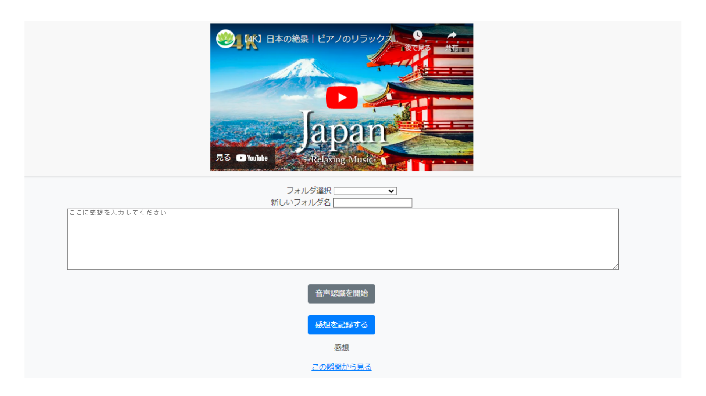

## 概要

YouTubeの動画を視聴しながら効率的にメモを取ることができます。

- **リアルタイムメモ**:
  - 各動画の視聴ページには音声認識機能を実装。
  - リアルタイムでメモを取ることが可能。

- **メモと動画の連携**:
  - メモを保存した動画の再生時間から再び動画を見ることができます。

## 開発理由
YouTubeで情報収集や学習のために様々な動画を見る際、気になったことをメモすることがあるのですが、別のサイトやツールを使って行うと複数のステップが必要で効率的ではありませんでした。そこで、これらのステップを一つのサイトで完結できるようにすることで、効率を向上させることを目的にこのサイトを作成しました。

## 機能一覧

| 項目                       | 内容                                            |
|----------------------------|-------------------------------------------------|
| **ページ1**                | ユーザー登録とログイン                          |
| ユーザー登録               | ユーザー名、メールアドレス、パスワードを入力     |
| ログイン                   | メールアドレスとパスワードを入力                |
| ゲストログイン             | クリックでログイン                              |
| **ページ2**                | パスワードリセット                              |
| パスワードリセット         | パスワードをリセットして再設定する              |
| **ページ3**                | 動画検索と表示                                  |
| 検索バー                   | キーワードで動画検索                            |
| 検索結果一覧               | サムネイル画像、タイトルの一覧表示              |
| **ページ4**                | 動画再生と感想の記録                            |
| 動画再生                   | 選択した動画を再生                              |
| 感想記録                   | 感想、メモを入力、音声認識でテキスト化           |
| **ページ5**                | 感想一覧表示とフィルタリング                    |
| 感想一覧                   | ユーザーの感想を一覧表示、並び替えやフィルタリング|
## 機能説明
### 音声認識
- **音声認識を開始**をクリックすると、ボタンが緑色に変化します。
- 緑色に変化した状態で発話する話すと、音声がテキストとして入力されます。
### 動画再生
- **この瞬間から見る**をクリックすると、感想を投稿した再生時間から動画が再生されます。

## 使用技術

| カテゴリ       | 技術                      |
| ------------- | ------------------------- |
| フロントエンド | HTML, CSS, JavaScript     |
| バックエンド   | Ruby, Ruby on Rails|
| データベース   | PostgreSQL                |
| API           | YouTube Data API v3       |
| テスト         | RSpec（単体テスト）         |
| バージョン管理 | GitHub                    |

# ER図

